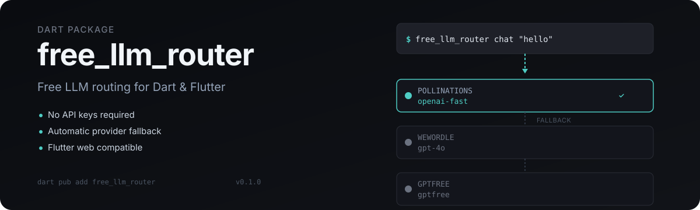

<p align="center">
  
</p>

# Free LLM Router for Dart

Route chat-completion requests to free, no-auth LLM providers. No API keys, no accounts, no setup — just send a message and get a response.

## Provider status

| Provider           | Status | Endpoint                      |
| ------------------ | ------ | ----------------------------- |
| **PollinationsAI** | live   | `text.pollinations.ai/openai` |
| **WeWordle**       | live   | `llmproxy.org`                |
| **GptFree**        | live   | Firebase-anonymous flow       |
| Chatai             | legacy | Endpoint DNS failed           |
| Yqcloud            | legacy | Endpoint rejected runner IP   |

Prompts are sent to third-party anonymous providers. Do not send secrets or sensitive data.

## Quick start

**Install:**

```bash
dart pub add free_llm_router
```

**CLI:**

```bash
dart run free_llm_router chat "what is 2+2?"
dart run free_llm_router chat --stream "write one short line"
dart run free_llm_router list
dart run free_llm_router models
```

**Dart API:**

```dart
import 'package:free_llm_router/free_llm_router.dart';
import 'package:free_llm_router/providers.dart';

final client = defaultClient();
final response = await client.chatCompletion(
  const ChatRequest(
    messages: [Message(role: 'user', content: 'Hello')],
  ),
);
print(response.choices.first.message.content);
```

The core library (`free_llm_router.dart`) has no `dart:io` import, so it is safe for Flutter web. I/O-backed providers are exported separately from `providers.dart`.

## How it works

### Routing strategies

Choose how providers are selected:

| Strategy     | Behavior                                                      |
| ------------ | ------------------------------------------------------------- |
| `priority`   | Try providers in registration order (default)                 |
| `weighted`   | Random selection weighted by provider weight                  |
| `roundRobin` | Cycle through providers in order                              |
| `random`     | Uniform random pick                                           |
| `leastUsed`  | Pick the provider with fewest recorded uses                   |
| `lkgp`       | Sticky to the last successful provider (Last-Known-Good Path) |

```dart
final client = FreeLlmRouterClient(
  strategyOptions: const StrategyOptions(
    strategy: RoutingStrategy.weighted,
    weights: {'pollinationsai': 2.0, 'wewordle': 1.0},
  ),
);
```

### Fallback policies

Define explicit per-model fallback chains:

```dart
final policy = FallbackPolicy();
policy.register('gpt-4o', [
  FallbackEntry(provider: 'wewordle', priority: 0),
  FallbackEntry(provider: 'pollinationsai', priority: 1),
]);

final client = FreeLlmRouterClient(fallbackPolicy: policy);
```

### Graceful degradation

The client tracks provider health and degradation status:

1. **Healthy** — provider responding normally
2. **Degraded** — a fallback path is active
3. **Failed** — a provider is currently unavailable
4. **Safe default** — both primary and fallback paths failed

Health tracking includes success/failure counts, latency trends, and automatic cooldown after consecutive failures.

### Model routing

Model strings can be plain (`auto`, `gpt-4o`) or provider-qualified (`pollinationsai/openai-fast`) to force a specific provider.

## Package layout

```
lib/
  free_llm_router.dart  # Platform-neutral core: client, types, registry, strategy, health, errors
  providers.dart        # dart:io providers and default registry (mobile/desktop/server/CLI only)
  src/
    client.dart           # Multi-strategy client with degradation support
    routing_strategy.dart # Priority, weighted, round-robin, random, least-used, LKGP
    degradation.dart      # Graceful degradation framework
    fallback_policy.dart  # Per-model fallback chain configuration
    health.dart           # Provider health tracking with cooldown
    registry.dart         # Provider registry and model alias resolution
    selector.dart         # Legacy priority-based selector
bin/
  free_llm_router.dart  # CLI
example/
  basic.dart              # Completion example
  streaming.dart          # Streaming example
```

## Validation

```bash
dart pub get
dart format --set-exit-if-changed bin example lib test
dart analyze
dart test
dart run free_llm_router list
```

Tests cover importability, registry routing, fallback, streaming, CLI, provider request shaping, and real e2e for all exported providers.

## Upstream reference

Provider behavior was studied from [`xtekky/gpt4free`](https://github.com/xtekky/gpt4free). Routing, fallback, and degradation ideas were adapted from [`diegosouzapw/OmniRoute`](https://github.com/diegosouzapw/OmniRoute) and [`decolua/9router`](https://github.com/decolua/9router). Attribution and the intentionally omitted upstream features are documented in [`THIRD_PARTY_NOTICES.md`](THIRD_PARTY_NOTICES.md).

## License

See repository for license details.
